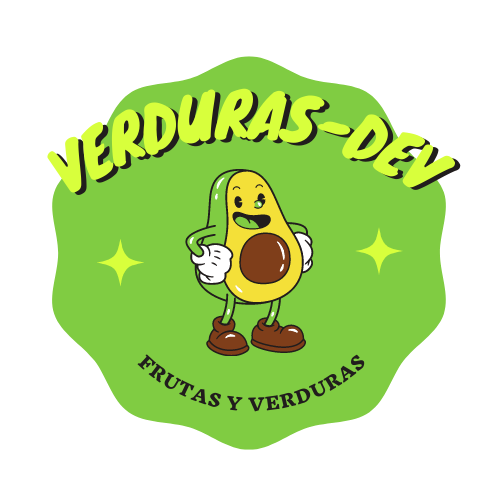

<h1 align="center">
  <br>
  <a href=""></a>
  <br>
  VerdurasDev
  <br>
</h1>

<h4 align="center">Gestión de inventarios o gestión de stocks que regula el flujo de entradas y las salidas de existencias de los productos dentro de <a href="" target="_blank">VerdurasDev</a>.</h4>

<p align="center">
  <a href="">
    
  </a>
  <a href="">
    
  </a>
  <a href="">
    
  </a>
  <a href="">
    
  </a>
</p>


## Características clave

* Front response 
* Plataforma
  - Listo para Windows, macOS y Linux.

## Cómo utilizar

Para clonar y ejecutar esta aplicación, necesitará [Git](https://git-scm.com) y [Node.js](https://nodejs.org/en/download/) (que viene con [npm](http://npmjs.com)) instalado en su computadora. Desde su línea de comando:

```bash
# Clonar repositorio
$ git clone https://github.com/nicolaievpustelnik/VerdurasDev

# Entra en el repositorio
$ cd VerdurasDev

# Instalar dependencias
$ npm install

# Ejecutar proyecto para producción 
$ npm start

# Ejecutar proyecto para desarrollo
$ npm run dev 

# Ejecutar test del proyecto
$ npm test 
```

> **Nota**
> Nota Si usa Linux Bash para Windows, [consulte esta guía](https://www.howtogeek.com/261575/how-to-run-graphical-linux-desktop-applications-from-windows-10s-bash-shell/) o use `node` desde el símbolo del sistema.

## Correo electrónico

Es decir, si te gustó usar esta aplicación o te ayudó de alguna manera, me gustaría que me envíes un correo electrónico a <verdurasdev@gmail.com> sobre cualquier cosa que quieras decir sobre este software. ¡Realmente lo apreciaría!

## Créditos

Este software utiliza los siguientes paquetes de código abierto:

- [Node.js](https://nodejs.org/)
- [Bootstrap](https://bootstrap.com)

## Support
<verdurasdev@gmail.com>

---

> GitHub [@nicolaievpustelnik](https://github.com/nicolaievpustelnik) &nbsp;&middot;&nbsp;
> GitHub [@debylanda_06](debylanda_06@hotmail.com) &nbsp;&middot;&nbsp;
> GitHub [@DelmerRo](https://github.com/DelmerRo) &nbsp;&middot;&nbsp;
> GitHub [@SantiagoVill](https://github.com/SantiagoVill) &nbsp;&middot;&nbsp;

